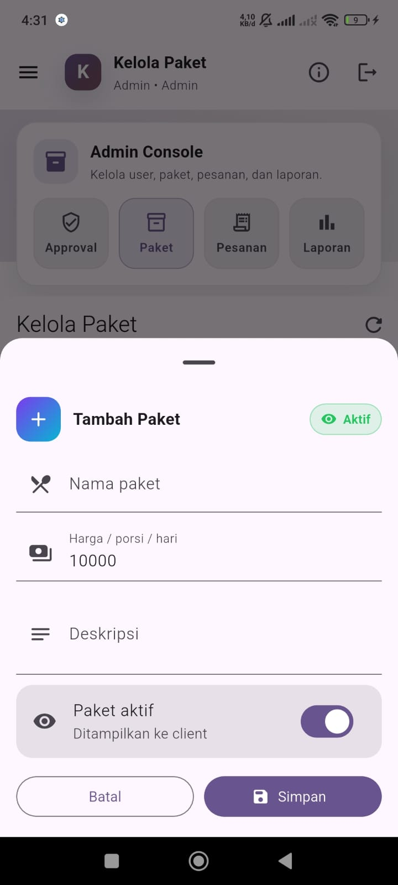
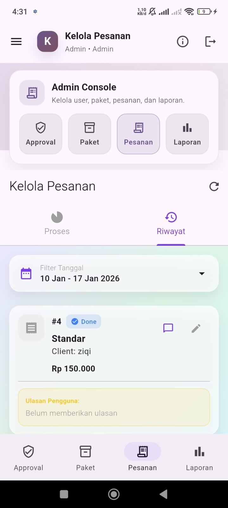
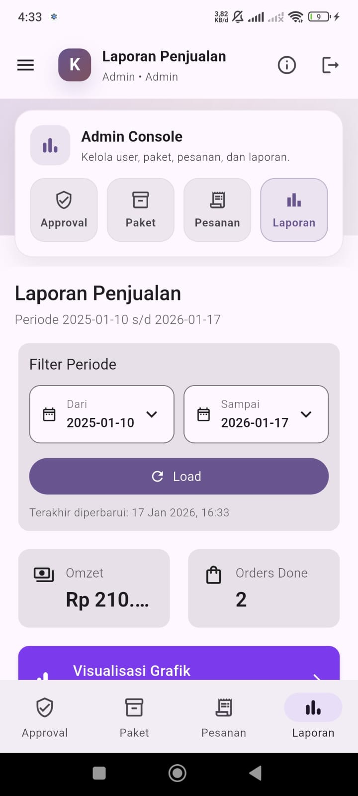
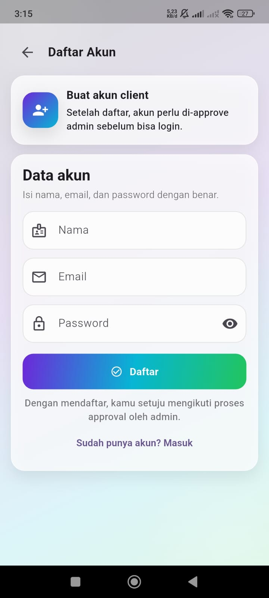
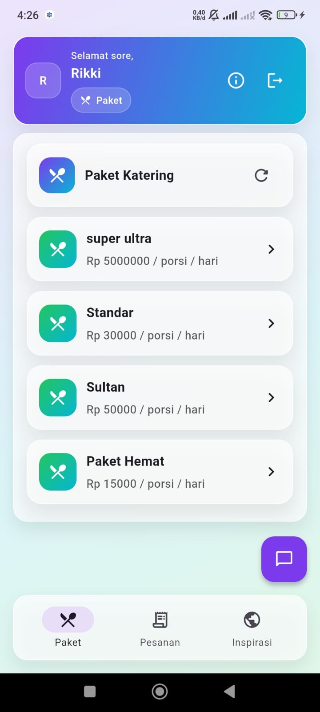
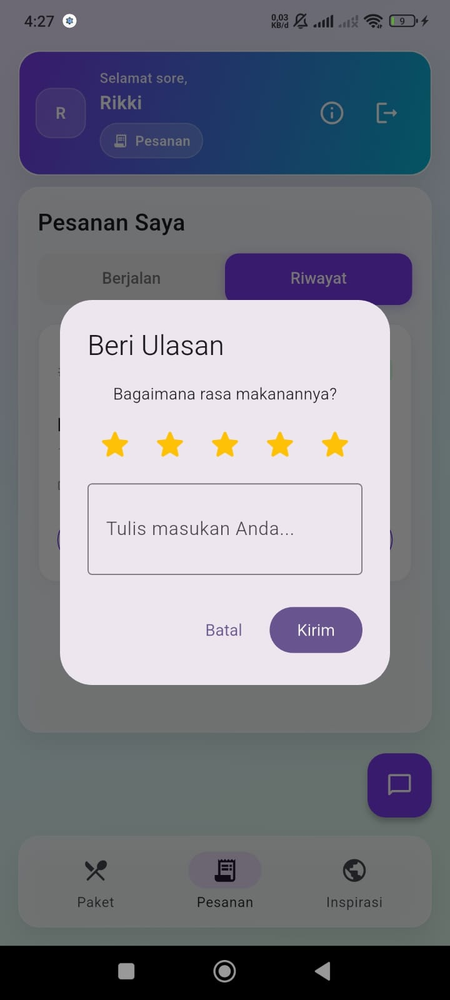
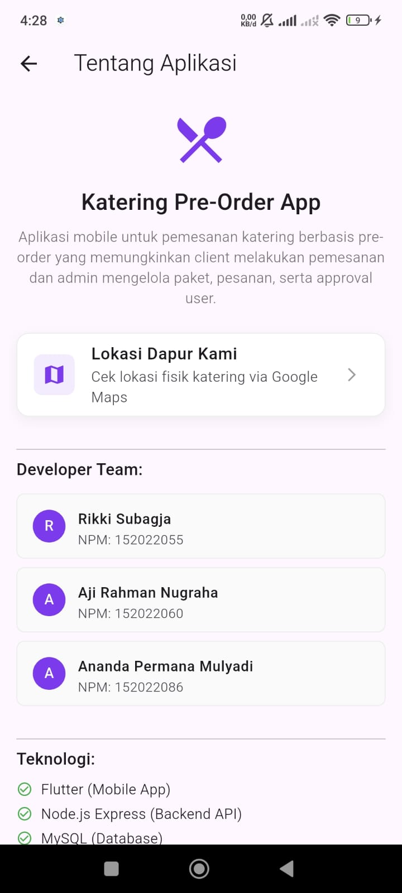
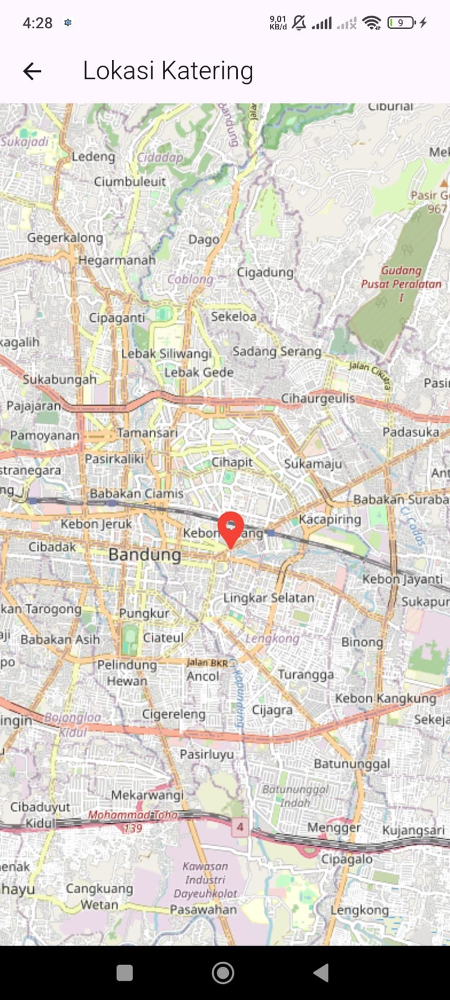

# 🍱 Bigmo Katering

**Bigmo Katering** adalah sistem aplikasi katering terintegrasi yang terdiri dari **Aplikasi Mobile** (untuk Client & Admin) dan **Backend Server** (REST API).

Aplikasi ini dirancang untuk mempermudah pemesanan paket katering harian secara praktis, dengan fitur pemisahan peran antara **Client** (Pelanggan) dan **Admin** (Pengelola).

---

## 👥 Tim Pengembang (Developer Team)

| Nama Mahasiswa | NPM | Peran |
| :--- | :--- | :--- |
| **Rikki Subagja** | 15-2022-055 | Developer |
| **Aji Rahman Nugraha** | 15-2022-060 | Developer |
| **Ananda Permana Mulyadi** | 15-2022-086 | Developer |

---

## 📱 Fitur Unggulan

Aplikasi ini mencakup spesifikasi teknis dan fitur sebagai berikut:

### 1. Sistem Approval User (Admin Control) 🛡️
Fitur keamanan di mana pengguna baru (Client) yang mendaftar **tidak bisa langsung login**. Data mereka masuk ke status *Pending* dan wajib di-*approve* oleh Admin terlebih dahulu melalui Admin Console. Ini mencegah akses tidak sah ke dalam aplikasi.

### 2. Integrasi API Public (TheMealDB) 🍲
Fitur **"Inspirasi Menu"** yang mengambil data resep makanan internasional secara *real-time* dari API [TheMealDB](https://www.themealdb.com). Fitur ini membantu user mencari ide menu makanan sehari-hari tanpa membebani database lokal.

### 3. Manajemen Pesanan (CRUD) 📝
* **Client:** Dapat memilih paket katering (Super Ultra, Standar, Sultan, Hemat), menentukan tanggal mulai langganan, dan memantau status pesanan.
* **Admin:** Memiliki kontrol penuh untuk mengubah status pesanan (*Approved -> Processing -> Delivering -> Done*) dan mengelola (Tambah/Edit/Hapus) daftar paket katering.

### 4. Laporan & Visualisasi Data 📊
Admin Dashboard dilengkapi dengan **Grafik Penjualan (Line Chart)** yang interaktif. Fitur ini memudahkan Admin untuk memantau tren pendapatan/omzet katering dalam periode tertentu secara visual.

### 5. Fitur Chat & Lokasi 📍💬
* **Live Chat:** Diskusi pesanan antara Client dan Admin secara *real-time* menggunakan layanan **Firebase Firestore**.
* **Lokasi Katering:** Integrasi Peta untuk menampilkan titik lokasi fisik dapur katering kepada pelanggan.

---

## 🛠️ Teknologi (Tech Stack)

Aplikasi ini dibangun menggunakan teknologi modern berikut:

| Komponen | Teknologi | Keterangan |
| :--- | :--- | :--- |
| **Frontend** | Flutter (Dart) | Aplikasi Mobile (Android) |
| **Backend** | Node.js + Express | REST API Server |
| **Database** | MySQL | Penyimpanan Data Relasional |
| **Realtime** | Firebase Firestore | Fitur Live Chat |
| **API Public** | TheMealDB | Sumber Data Resep Luar |

---

## 🚀 Panduan Instalasi (Step-by-Step)

Untuk menjalankan aplikasi ini secara utuh, silakan ikuti urutan berikut agar tidak terjadi error koneksi:

### 1️⃣ Setup Database & Backend 🗄️

1.  **Database MySQL:**
    * Nyalakan XAMPP/MySQL.
    * Buat database baru di phpMyAdmin bernama: `katering_preorder`.
    * Import file SQL yang ada di folder `database/katering.sql`.

2.  **Jalankan Server Backend:**
    Buka terminal dan masuk ke folder backend:
    ```bash
    cd backend_mysql
    npm install
    npm start
    ```
    *Server akan berjalan di `http://localhost:3000`.*

### 2️⃣ Setup Aplikasi Mobile (Flutter) 📱

1.  **Buka Terminal Baru:**
    Biarkan terminal backend tetap berjalan, buka terminal/tab baru di VS Code.

2.  **Jalankan Aplikasi:**
    Masuk ke folder aplikasi mobile:
    ```bash
    cd katering_preorder
    flutter pub get
    flutter run
    ```

---

## 📸 Dokumentasi Lengkap Aplikasi

Berikut adalah dokumentasi tampilan antarmuka (UI) aplikasi Bigmo Katering:

### A. Tampilan Umum & Autentikasi
| Loading Screen | Login |
| :---: | :---: |
|  |  |
| *Loading Screen Awal* | *Form Masuk* |

---

### B. Fitur Admin (Pengelola)
Admin memiliki hak akses penuh untuk mengelola operasional katering.

| 1. Dashboard Approval | 2. Kelola Paket | 3. Tambah Paket |
| :---: | :---: | :---: |
|  |  |  |
| *Approve User Pending* | *List Paket Makanan* | *Form Input Paket* |

| 4. Proses Pesanan | 5. Riwayat Pesanan | 6. Diskusi Pesanan |
| :---: | :---: | :---: |
|  |  |  |
| *Update Status Pesanan* | *History Transaksi* | *Live Chat Admin* |

| 7. Laporan Penjualan | 8. Grafik Penjualan |
| :---: | :---: |
|  |  |
| *Ringkasan Omzet* | *Visualisasi Grafik* |

---

### C. Fitur Customer (Pelanggan)
Client dapat melihat menu, memesan, dan melacak pesanan.

| 1. Register User | 2. Inspirasi Menu | 3. Daftar Paket |
| :---: | :---: | :---: |
|  |  |  |
| *Halaman Register* | *Integrasi TheMealDB* | *Pilih Paket* |

| 4. Pesanan & Riwayat | 5. Ulasan Produk | 6. Tentang Aplikasi |
| :---: | :---: | :---: |
|  |  |  |
| *Tracking Order* | *Rating & Review* | *Info Developer* |

| 7. Lokasi Katering |
| :---: |
|  |
| *Maps Lokasi Dapur* |

---

## 📂 Lampiran Teknis

Berikut adalah bukti implementasi teknis Database dan Integrasi API yang digunakan.

### 1. Struktur Database (MySQL)
Berikut adalah desain tabel relasional yang digunakan dalam sistem (Tabel Users, Packages, Orders):


### 2. Integrasi API (TheMealDB)
Aplikasi menggunakan API publik dari **TheMealDB** sebagai sumber data untuk fitur "Inspirasi Menu":


---
Copyright © 2026 - Bigmo Katering
