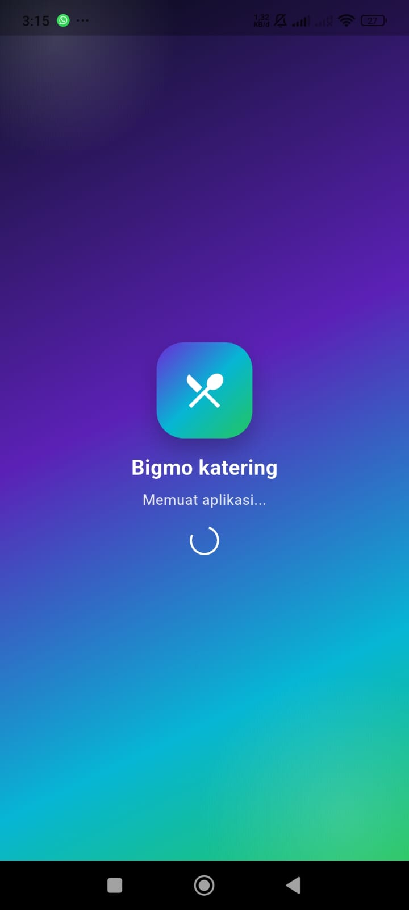
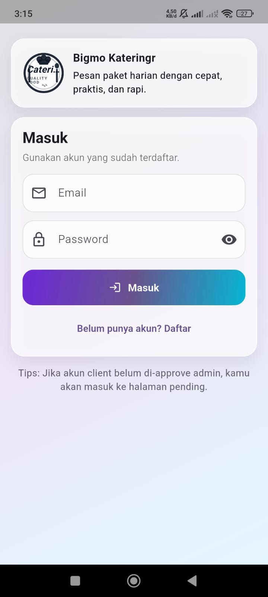
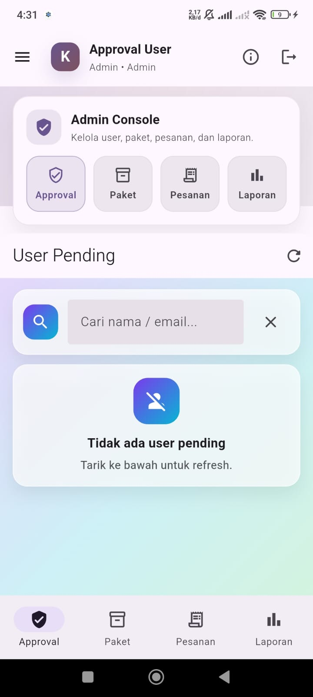
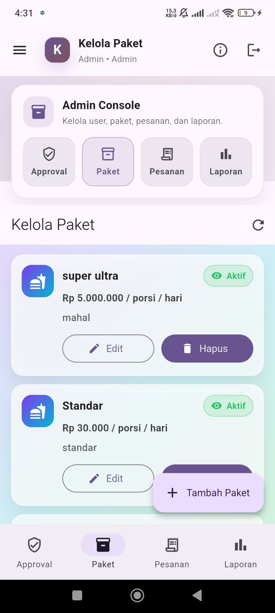
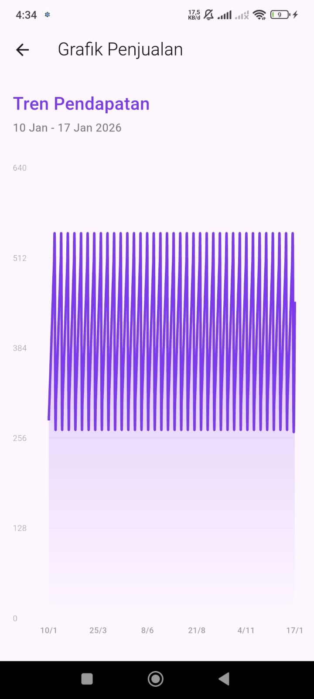
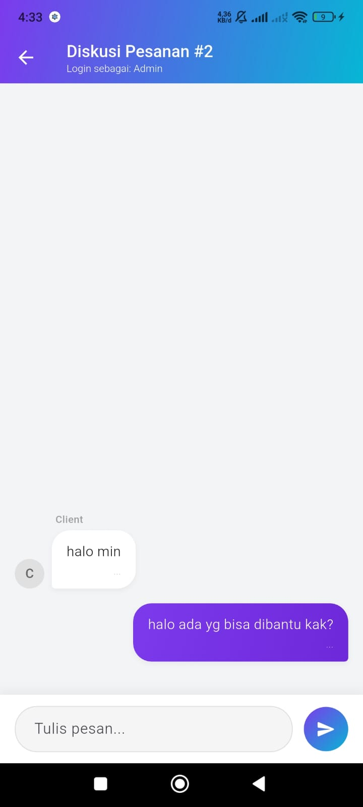
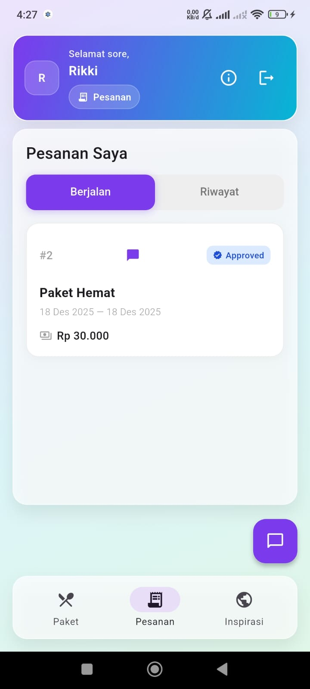

# 📱 Bigmo Mobile App (Flutter)

Modul ini adalah **Frontend Aplikasi** yang dibangun menggunakan **Flutter**. Aplikasi ini memiliki dua peran pengguna (Client & Admin) dalam satu *codebase* yang sama.

---

## 📸 Dokumentasi Tampilan (UI)

Berikut adalah antarmuka aplikasi Bigmo Katering yang telah dikembangkan:

### A. Autentikasi & Umum
| Loading Screen | Login / Register |
| :---: | :---: |
|  |  |
| *Tampilan awal* | *Form Masuk & Daftar* |

### B. Fitur Admin (Pengelola)
| Dashboard Approval | Kelola Paket | Proses Pesanan |
| :---: | :---: | :---: |
|  |  |  |
| *Approve user baru* | *CRUD Paket Makanan* | *Update status pesanan* |

| Grafik Laporan | Live Chat Admin |
| :---: | :---: |
|  |  |
| *Visualisasi Omzet* | *Chat dengan Client* |

### C. Fitur Client (Pelanggan)
| Dashboard User | Inspirasi Menu (API) | Riwayat Pesanan |
| :---: | :---: | :---: |
|  |  |  |
| *Menu Utama* | *Integrasi TheMealDB* | *Tracking Pesanan* |

---

## 📱 Fitur Utama

1.  **Multi-Role System:** Login sebagai Admin atau Client dengan tampilan berbeda.
2.  **Admin Approval:** Keamanan ekstra, user baru harus disetujui Admin.
3.  **Realtime Chat:** Diskusi pesanan menggunakan Firebase Firestore.
4.  **API Integration:** Mengambil data resep dari *TheMealDB*.
5.  **Interactive Charts:** Grafik penjualan untuk analisis Admin.
6.  **Maps Integration:** Menampilkan lokasi dapur katering.

---

## 🛠️ Instalasi & Menjalankan (Run)

Pastikan backend server sudah berjalan sebelum menjalankan aplikasi ini.

1.  **Buka Terminal** di folder `katering_preorder`.
2.  **Install Dependencies:**
    ```bash
    flutter pub get
    ```
3.  **Jalankan Aplikasi:**
    ```bash
    flutter run
    ```

> **Catatan:** Jika gambar tidak muncul, pastikan Anda sudah membuat folder `assets/screenshots` di dalam folder ini dan memasukkan file gambar png sesuai nama di atas.

---
Copyright © 2026 - Bigmo Katering Mobile
